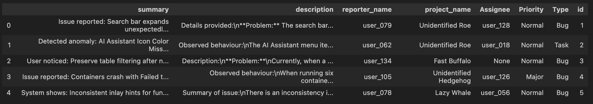
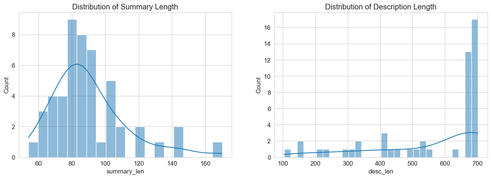
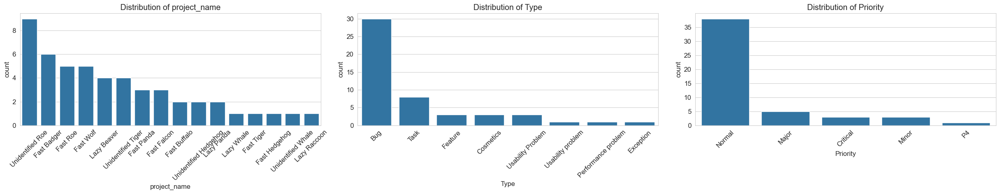
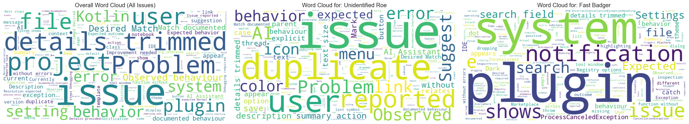
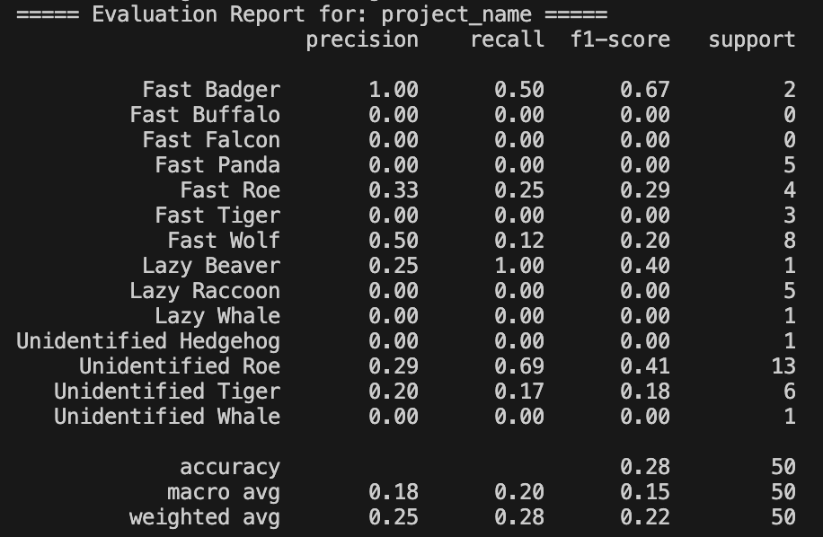
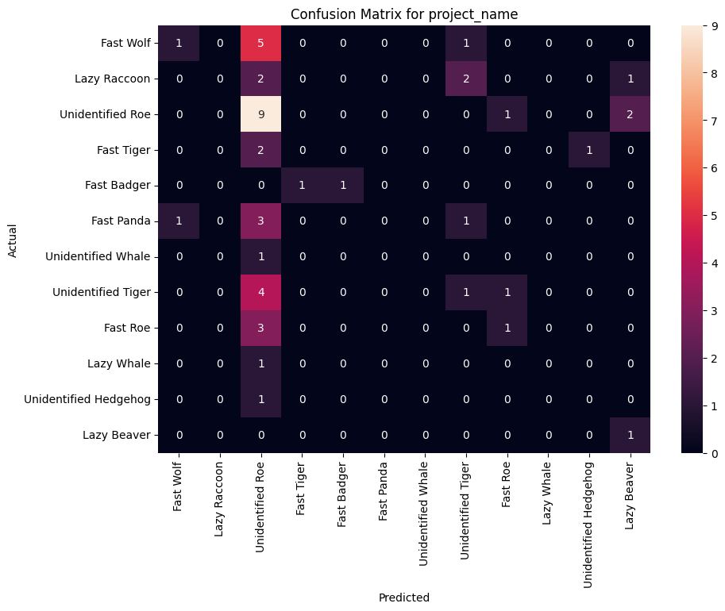
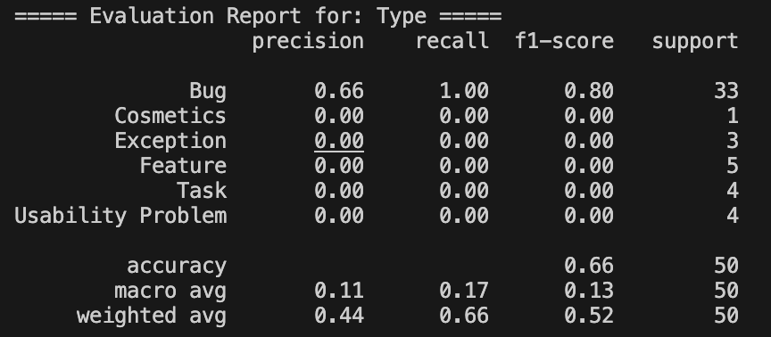
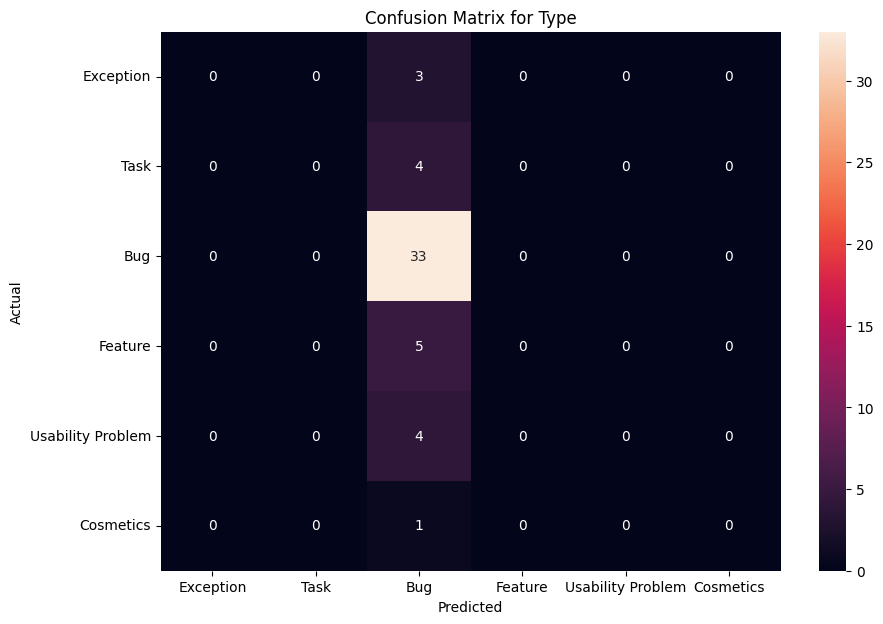
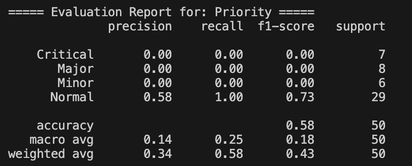
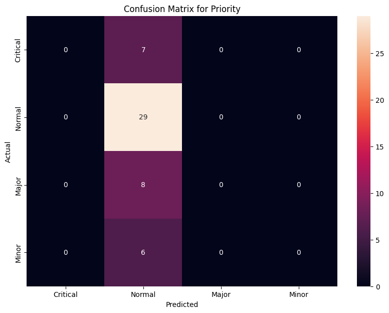

# Issue Classifier

This repository contains my solution for the internship programming task.

## Getting Started

Follow these instructions to set up the environment and run the project.

### Prerequisites
* Python 3.12
* Jupyter Notebook (for running the EDA)

### Installation & Execution
1.  **Clone the repository:**
    ```bash
    git clone https://github.com/JerryHung1030/issue-classifier.git
    cd issue-classifier
    ```
2.  **Create and activate a virtual environment:**
    ```bash
    python3 -m venv venv
    source venv/bin/activate
    ```
3.  **Install dependencies:**
    ```bash
    pip install -r requirements.txt
    ```
4.  **Run the main script:**
    To train the final models and generate the predictions, execute the main script.
    ```bash
    python3 predict_issues.py
    ```
    This will create the final deliverable `processed_issues.json` inside the `data/` directory and save evaluation artifacts (confusion matrices) in the `images/` directory.

---

## My Methodology

My approach follows a standard data science workflow:
1.  **Exploratory Data Analysis (EDA):** First, I dissected the training data to understand its characteristics and uncover potential challenges.
2.  **Model Selection & Cross-Validation:** I then used a cross-validation process to objectively compare baseline models and select the most suitable one for each prediction task.
3.  **Final Evaluation:** Finally, I trained the chosen models on the full training set and evaluated their real-world performance against a manually labeled "gold standard" test set.

---

## 1. Exploratory Data Analysis (EDA)

*(This section summarizes the key findings from the `EDA.ipynb` notebook.)*

### Data Snapshot & Text Characteristics



* **Note:** The data consists of short `summary` fields and widely varying `description` lengths. The longer descriptions likely contain crucial information, justifying the strategy of combining both fields for feature extraction.

### Target Variable Distributions & Keyword Analysis



* **Note:** The analysis shows two critical points:
    1.  All target variables suffer from **severe class imbalance**, especially `project_name` and `Priority`. This is the primary challenge for this task.
    2.  Keyword analysis confirms that different projects use distinct terminology (ex: UI terms for `Unidentified Roe` vs. system terms for `Fast Badger`), proving that the text contains a strong predictive signal.

---

## 2. Model Selection & Cross-Validation

To select the best algorithm, I evaluated three robust baseline models.

### Cross-Validation Results
The models were evaluated on their mean accuracy across 5 folds on the 50-sample training set.

| Target         | Logistic Regression | Multinomial Naive Bayes | Linear SVC (SVM)        |
| :------------- | :------------------ | :---------------------- | :---------------------- |
| `project_name` | 0.180 (+/- 0.040)   | 0.180 (+/- 0.040)       | **0.320 (+/- 0.204)** |
| `Type`         | **0.600 (+/- 0.000)** | 0.600 (+/- 0.000)       | 0.600 (+/- 0.000)       |
| `Priority`     | **0.760 (+/- 0.049)** | 0.760 (+/- 0.049)       | 0.760 (+/- 0.049)       |

### Decision
* **Analysis:** The low scores for `project_name` and the misleadingly high scores for `Priority` (which matches the majority class prevalence of 76%) confirm that class imbalance is the dominant factor.
* **Models Chosen:**
    * `project_name`: **Linear SVC (SVM)** for its slightly better, albeit unstable, performance.
    * `Type` & `Priority`: **Logistic Regression** for its simplicity, as all models performed identically by adopting a majority-class prediction strategy.

---

## 3. Final Evaluation Against Gold Standard

To conduct a definitive final evaluation, I created a "gold standard" test set by manually labeling the 50 prediction issues.

> **Note:** These labels are based on my own judgment and serve as a consistent benchmark for this project, not as an official ground truth.

#### Evaluation for `project_name`
| Classification Report | Confusion Matrix |
| :---: | :---: |
|  |  |


* **Note**: Accuracy is low (28%) due to class imbalance. The model over-predicts `Unidentified Roe,` the majority class.

#### Evaluation for `Type`

| Classification Report | Confusion Matrix |
| :---: | :---: |
|  |  |


* **Note**: Accuracy is 66%, but the model predicts `Bug` for most cases, ignoring minority classes.

#### Evaluation for `Priority`

| Classification Report | Confusion Matrix |
| :---: | :---: |
|  |  |

---

## 4. Conclusion & Future Work

### Conclusion
The results are not a reflection of poor model performance but an **accurate diagnosis of the dataset's core limitations**: extreme data scarcity and severe class imbalance. The key takeaway is that with the current data, even robust baseline models rationally default to the safest strategies. The primary bottleneck is the dataset itself.

### Future Work
1.  **Enrich the Dataset**: The most critical step is to **acquire more labeled data**.
2.  **Advanced Imbalance Handling**: Implement techniques like setting `class_weight='balanced'` in the models or using sampling methods (ex: SMOTE).
3.  **Richer Feature Representation**: Move beyond TF-IDF to contextual **word embeddings** (ex: Word2Vec) to capture semantic meaning.
4.  **Experiment with Complex Models**: Once a sufficient amount of data is available, it would become feasible to experiment with more data-hungry models like **Gradient Boosting (XGBoost)** or a **Transformer (ex: DistilBERT)**.